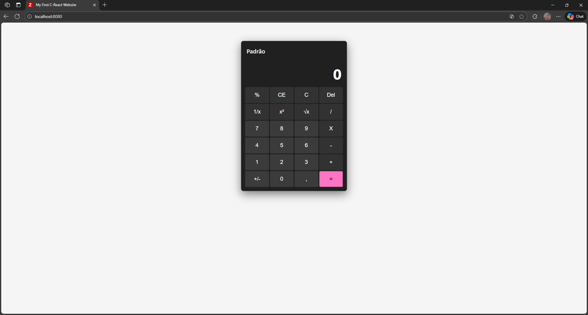
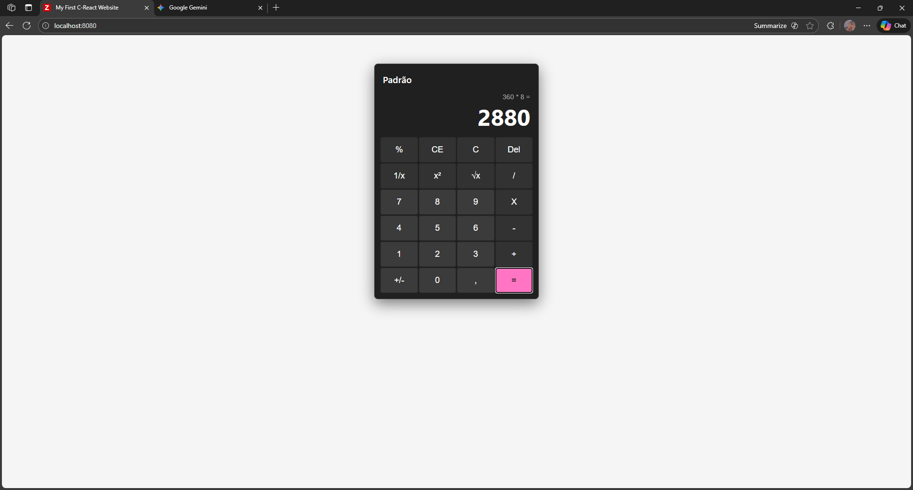
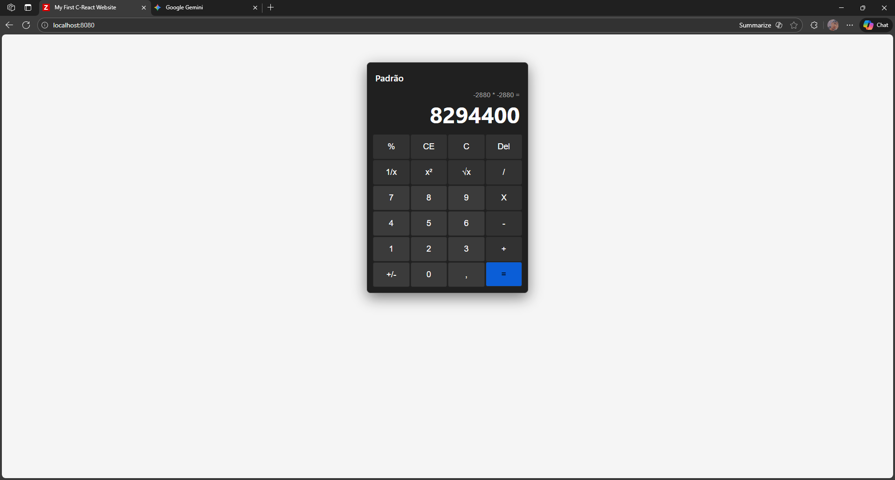

# Projeto OUI - C-Calc WebAssembly

Este projeto consiste em uma calculadora científica desenvolvida em **C puro**, compilada para **WebAssembly (Wasm)** e executada no navegador. O ambiente é totalmente orquestrado via Docker, garantindo que o compilador e o servidor web funcionem sem necessidade de instalação local de ferramentas (como GCC ou Python).

## Capturas de Tela

Visualização do projeto rodando no navegador:

| Layout Padrão | Histórico e Cálculos |
|:---:|:---:|
|  |  |

| Detalhes |
|:---:|
| |

---

## Pré-requisitos

- **Docker** instalado e rodando.

## Como Executar

1. Abra o terminal na pasta raiz do projeto.
2. Execute o comando para subir o ambiente:

```bash
docker compose up
````

3.  Aguarde a mensagem de compilação e acesse no seu navegador:
      - **http://localhost:8080**

## Como Desenvolver

O projeto possui um sistema de **Hot Reload** para o código C.

1.  Com o Docker rodando, abra o arquivo:
      - `calculadora/app.c`
2.  Faça qualquer alteração no código e salve o arquivo.
3.  O container `compiler` detectará a mudança, recompilará o código automaticamente e atualizará o binário `app.js`.
4.  Basta atualizar a página no navegador (F5) para ver as mudanças.

-----

## Estrutura do Projeto

  - **calculadora/**: Código fonte (`app.c`) e arquivos web (`index.html`).
  - **dep/**: Dependências do C-React e C2Wasm (baixadas automaticamente).
  - **docker-compose.yml**: Orquestração dos containers (Web Server + Compilador Emscripten).
